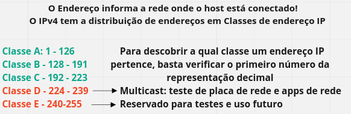
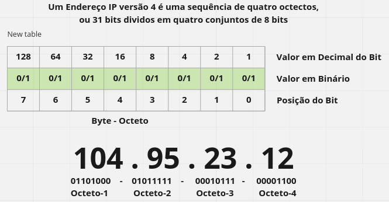
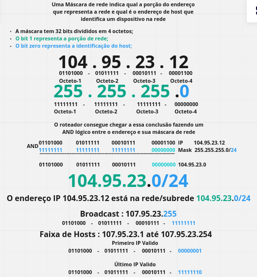
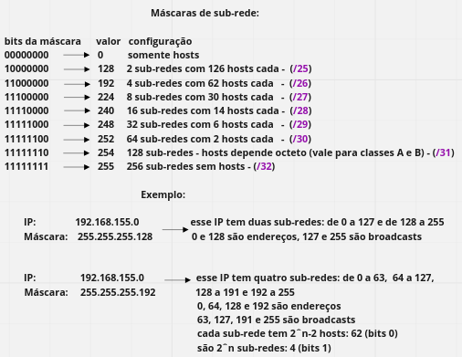

# NetPractice

Project has the purpose of correctly configuring simple networks Manipulating the IPs and Addressing Mask.
The network configuration is done through the IPv4 Protocol!

What is the IP Protocol?
Internet Protocol: The communication protocol of the internet;
It is responsible for addressing and packets that travel over the internet;
This Protocol is established at the Network Layer of the OSI Model and TCP/IP Suite;

----------------------------------------------------------------------------------------
Projeto tem a finalidade de configurar corretamente redes simples Manipulando os IPs e Máscara de endereçamento.
A configuração da rede é feita através do Protocolo IPv4!

O que é o Protocolo IP?
Internet Protocol: O protocolo de comunicação da internet;
Ele é responsável por endereçar e encaminhar os pacotes que trafegam pela internet;
Esse Protocolo é estabelecido na Camada de rede do Modelo OSI e Suíte TCP/IP;

__________________________________________________________________________________________

## CALCULOS:

```bash
Com o último octeto da máscara descubro de quanto em quanto variam as sub-redes:

255 destinado ao host(a quantidade de aparelhos que posso conectar). 
Porêm o 1º e o último não são permitidos (Primeiro IP é o endereço da sub-rede e o último do broadcast).


-------------------------------------------------------------------------------------------		   	   
|128 64 32 16 8 4 2 1 |128 64 32 16 8 4 2 1 | 128 64 32 16 8 4 2 1 | 128 64 32 16 8 4 2 1 |
-------------------------------------------------------------------------------------------
| 1  1  1  1  1 1 1 1 | 1  1  1  1  1 1 1 1 |  0   0  0 0 0  0 0 0 |  1   1  1  1 1 0 0 0 |
------------------------------------------------------------------------------------------- 		
|      255            |        255          |        255           |         248          |
-------------------------------------------------------------------------------------------
Essa rede pertence a classe A
	 	
2^n   (sendo n=0. indica a número total de host)      2³ = 8 host  (calcula) 2X2X2     = 8
2^n-2 (sendo n=0. indica a o número de hosts validos) 2³ = 6 host válidos    2X2X2 - 2 = 6
 
2^n (sendo n=1. Indica o número de subredes) 2⁵ = 32 = 2X2X2X2X2
 		   			   
 			   1°	0   - 7	
 			   2°	8   - 15 
 			   3°	16  - 23	
 			   4°	24  - 31 
 			   5°	32  - 39
 			   6°	40  - 47
 			   7°	48  - 55
 			   8°	56  - 63
 			   9°	64  - 71
 			  10°   72  - 79
 			   
 			   ...	248 - 255	
       
__________________________________________________________________________________________			   
 	
com os 2 últimos octetos da máscara descubro de quanto em quanto variam as sub-redes:  
-------------------------------------------------------------------------------------------		   	   
|128 64 32 16 8 4 2 1 |128 64 32 16 8 4 2 1 | 128 64 32 16 8 4 2 1 | 128 64 32 16 8 4 2 1 |
-------------------------------------------------------------------------------------------
| 1  1  1  1  1 1 1 1 | 1  1  1  1  1 1 1 1 |  0   0  0 0 0  0 0 0 |  0   0  0  0 0 0 0 0 |
------------------------------------------------------------------------------------------- 		
|      255            |        255          |         0            |         0            |
-------------------------------------------------------------------------------------------
 			   
 			   
 1ª Classe     : C "192 a 223"
 2ª mask rede  : 255.255.0.0
 3° host Total : 2^n (n=0)     ->  2^16      = 65.536   (calcula - 2X2X2)  
 4° host valido: 2^n-2 (n=0)   -> (2^16)-2   = 65.534
 5° Sub-redes  : 2^n (n=1)     -> 2^0        = 1 
 
 2^n   (sendo n=0. indica a número total de host)  2   (calcula - 2X2X2)   
 2^n-2 (sendo n=0. indica a o número de hosts validos) 
 2^n (sendo n=1. Indica o número de subredes) 
 
__________________________________________________________________________________________
 
 
-------------------------------------------------------------------------------------------		   	   
|128 64 32 16 8 4 2 1 |128 64 32 16 8 4 2 1 | 128 64 32 16 8 4 2 1 | 128 64 32 16 8 4 2 1 |
-------------------------------------------------------------------------------------------
| 1  1  1  1  1 1 1 1 | 1  1  1  1  1 1 1 1 |  0   0  0 0 0  0 0 0 |  1   1  1  0 0 0 0 0 |
------------------------------------------------------------------------------------------- 		
|      255            |        255          |         255          |         224          |
-------------------------------------------------------------------------------------------
 
 1ª Classe     : B  (128 a 191)
 2ª mask rede  : 255.255.224.0
 3° host Total : 2^n (n=0)   ->  2^5        = 32   (calcula - 2X2X2x2x2)  
 4° host valido: 2^n-2 (n=0) -> (2^5)-2     = 30
 5° Sub-redes  : 2^n (n=1)   ->  2^3        = 8
  
 passo 1: subredes variam de 32 e 32 -"2^n (n=1)"
 passo 2: escreva subredes                  = (0-31)(32-63)(64-95)(96-127)(128-159)(160-191)(192-223)(224-255)
 passo 3: 1° endereço é a subrede           = 0 - 32 - 64 -96 -128 - 160 - 192 - 224 
  	   Segundo ao penultimo são hosts        = (1-30)(33-32)
  	   Ultimo o broadcast                    = 31 - 63 - 95 ...
 passo 4: N° sub-redes (2^n) sendo n=1      = 2^3   = 8
 passo 5: N° host validos (2^n-2) sendo n=0 = 2^5-2 = 30
 
_____________________________________________________________________________________________
              			    
-------------------------------------------------------------------------------------------		   	   
|128 64 32 16 8 4 2 1 |128 64 32 16 8 4 2 1 | 128 64 32 16 8 4 2 1 | 128 64 32 16 8 4 2 1 |
-------------------------------------------------------------------------------------------
| 1  1  1  1  1 1 1 1 | 1  1  1  1  1 1 1 1 |  0   0  0 0 0  0 0 0 |  1   1  1  1 1 1 0 0 |
------------------------------------------------------------------------------------------- 		
|      255            |        255          |         255          |         252          |
-------------------------------------------------------------------------------------------
 
passo 1: N° sub-redes (2^n) sendo n=1 2^6    = 64
passo 2: subredes variam de 4 e 4 (indicado pelo ultimo número 1)
passo 3: escreva subredes                    = (0-3) (4-7) (8-11) (12-15) ...
passo 4: 1° endereço é a subrede             = 0 - 4 - 8 - 12 ...
 	  Segundo ao penultimo são hosts validos   = (1-2)(5-6) (9-10) (13-14)
  	 Ultimo o broadcast                       =  3 - 7 - 11 - 15 ... 
  	  
  	  
_____________________________________________________________________________________________ 	  
 	  

-------------------------------------------------------------------------------------------		   	   
|128 64 32 16 8 4 2 1 |128 64 32 16 8 4 2 1 | 128 64 32 16 8 4 2 1 | 128 64 32 16 8 4 2 1 |
-------------------------------------------------------------------------------------------
| 1  1  1  1  1 1 1 1 | 1  1  1  1  1 1 1 1 |  0   0  0 0 0  0 0 0 |  1   0  0  0 0 0 0 0 |
-------------------------------------------------------------------------------------------
|      255            |        255          |         255          |         128          |
-------------------------------------------------------------------------------------------
  	  
passo 1: N° sub-redes (2^n sendo n=1) 2^1      = 2
passo 2: subredes variam de 128
passo 3: escreva subredes                      = (0-127) , (128-255)
passo 4: 1° endereço é a subrede               = (0 - 128)
  	 Ultimo o broadcast                         = (127 - 255)
 	  Segundo ao penultimo são hosts validos     = (1-126) , (129-254)
  	 	  
__________________________________________________________________________________________

-------------------------------------------------------------------------------------------
|128 64 32 16 8 4 2 1 |128 64 32 16 8 4 2 1 | 128 64 32 16 8 4 2 1 | 128 64 32 16 8 4 2 1 |
-------------------------------------------------------------------------------------------
| 1  1  1  1  1 1 1 1 | 1  1  1  1  1 1 1 1 |  0   0  0 0 0  0 0 0 |  1   0  0  0 0 0 0 0 |
-------------------------------------------------------------------------------------------
|      255            |        255          |           0          |           0          |
-------------------------------------------------------------------------------------------

 	
passo 1: N° sub-redes (2^n sendo n=1) 2^16  =  (6556)
passo 2: subredes variam de                =  (256)    a  (256)
passo 3: escreva subredes                  =  (0-255)     (256-511)
passo 4: 1° endereço é a subrede           = 	(0)      ,  (256)
  	  Ultimo o broadcast                    = 	(255)    ,  (510)
 	   Segundo/penultimo hosts validos       =  (1-254)  ,  (257-510)	
     
_________________________________________________________________________________________

-------------------------------------------------------------------------------------------
|128 64 32 16 8 4 2 1 |128 64 32 16 8 4 2 1 | 128 64 32 16 8 4 2 1 | 128 64 32 16 8 4 2 1 |
-------------------------------------------------------------------------------------------
| 1  1  1  1  1 1 1 1 | 1  1  1  1  1 1 1 1 |  1   1  1  1 1 1 1 1 |  1   0  0  0 0 0 0 0 |
-------------------------------------------------------------------------------------------
|      255            |        255          |           255        |           0          |
-------------------------------------------------------------------------------------------
 	
passo 1: N° sub-redes (2^n sendo n=1) 2^24  = (16,7)
passo 2: subredes variam de                 = (256)     a   (256)
passo 3: escreva subredes                   = (0-255)       (256-511)
passo 4: 1° endereço é a subrede            =	(0)       ,   (256)
  Ultimo o broadcast                        =	(255)     ,   (510)
  Segundo/penultimo hosts validos           =  (1-254)  ,   (257-510)	  
```

## Badge


## My grade


## Skills
Rigor <br>
Network & system administration 

## Flowchat:





### Made with: <br/>
### Jorge Alves
<div style="display: inline_block">
 <a href="https://github.com/jorgeedualves/jorgeedualves" target="_blank"></a>
 <a href="https://www.linkedin.com/in/jorge-eduardo-alves-094b4331/" target="_blank"></a> 
</div>

### Alexandre Zamarion
<div style="display: inline_block">
 <a href="https://github.com/alezamarion" target="_blank"></a>
 <a href="https://www.linkedin.com/in/alexandre-zamarion-cepeda-a3766323a/" target="_blank"></a> 
</div>
